# DevOps Project
Authors: Lucas BALBI, Elise BRUNETON et Victor DENIS.

## Description
This project is a messaging platform that allows users to create accounts, send messages, and manage conversations. 
Organization:
   - I. Work Performed
   - II. Screenshots
   - III. Instructions
   - IV. Links
   - V. Additional Info

## I. Work Performed
### 1. Web Application
We created a web application using Python -Flask, HTML/CSS and JS. The data is stored/pulled with a Redis database via GET/POST requests in Flask. 
The app runs on a python virtual environment (venv) on the host machine.

The app features:
   - User Management:
      - Create new users with name, surname, and email.
      - Delete users.
      - View a list of saved accounts.
      - Check for email duplicate when creating a new user

   - Messaging System:
      - Select a user to send messages.
      - View message history.
      - Delete messages.
      - Check for user validity when deleting a message

### 2. CI/CD pipeline
Use of GitHub actions with a ci-cd.yaml file featuring:

   - Continuous integration:
      - Specifies the environment for executing the CI tasks.
      - Uses the actions/checkout action to fetch the repository's code
      - Configures *Python 3.8*
      - Upgrades *pip* and installs the required dependencies listed in `dependances.txt`
      - Starts the Flask application (python app.py) in the background.
      - Checks if the app responds to HTTP requests using curl.

   - Continuous delivery/deployment:
      - Builds a Docker image for the application
      - Deploy with Docker Compose (error pops up)
      - Apply Kubernetes manifest. (error pops up)


This CI/CD pipeline automates testing and deployment for our project to ensure efficiency and reliability. It is triggered by any push or pull request on the main branch. The pipeline has two main jobs: Build and Deploy.

In the Build job, the repository is checked out, *Python 3.8* is set up, and dependencies are installed from `dependances.txt`. The Flask application is then launched and verified using a curl request to ensure it responds correctly. This step ensures that the application runs without errors in a clean environment.

The Deploy job begins after a successful build. It constructs a Docker image of the application and launches it using Docker Compose. Additionally, Kubernetes manifests located in the `kube/` directory are applied to deploy the application on a Kubernetes cluster. The deployment status is monitored to confirm its success.

### 3. Docker image
The app can be built into a docker image with a dockerfile. It can then be run as a container on localhost with the same features described in **1.Web application**.

The docker image was also pushed to DockerHub (and updated as needed). The DockerHub account can be found in part IV-Links.

### 4. Container orchestration with Docker-Compose
Automatization of the build of the app and the redis connection service with a docker-compose.yml file.
The app can now run directly without having to manually start redis services.

### 5. Orchestration using Kubernetes
Creation of MANIFEST YAML files that ensures:
   - Deployments (for Redis and the Flask app)
   - Services (for Redis and the Flask app)
   - persistent volume/persistent volume claim (for Redis)

App can run through a minikube service using a tunnel, exposing it on a displayed port of localhost.

### 6. Configure and provision a virtual environment / IaC approach
Configuration of a Vagrantfile to create an ubuntu VM with the VirtualBox provider, and allow for ssh connection to the VM from the host machine. Also creates a shared folder that contains the app files between the host machine and the VM.

Provisioning the VM with ansible, that allows for:
   - Updating apt packages
   - Installing Python3, Pip3 and python3-venv
   - Installing and starting Redis services
   - Installing and starting Docker services

***Note:*** *The app does not run automatically when connecting to the VM, but you can run it easily using docker or flask python3 (see part **III. Instructions**).*
 
### 7. Make a service mesh using Istio
In this section, we attempted to implement a service mesh using Istio for our Flask application. The objective was to deploy the application using Istio on a Kubernetes cluster and configure traffic routing between two different versions of the application. We also aimed to implement dynamic load balancing, allowing for progressive traffic shifting between the two versions.

**What Could a Service Mesh Have Brought to the Project?**
A service mesh like Istio offers several advantages that go beyond simple service communication. These include:
   - Traffic Management
   - Resilience and Observability
   - Security
   - Ease of Scaling

Incompatibility Between Istio and WSL2:
   - We developed and tested our solution on a Windows environment using WSL2 with Minikube. However, Istio does not always function correctly with WSL2 due to networking issues (limitations of the service tunnel).
   - Traffic shifting could not be verified because Istio services exposed via Minikube were inaccessible from the browser or curl.


## II. Screenshots
All screenshots are stored in the `captures/` folder. Here are the explaination for every screen:


<hr style="border: 1px dashed #333;">

### 1. WebApp
<div style="text-align: center;">
   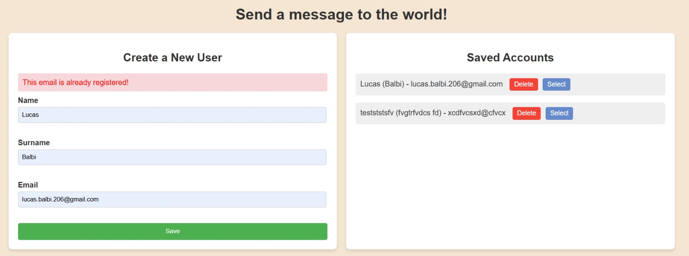 <br> 
   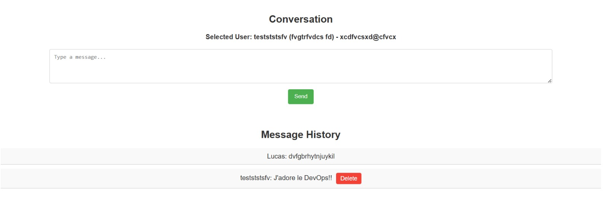 <br> 
   Screenshots of the page web.
   <br> <br> 

   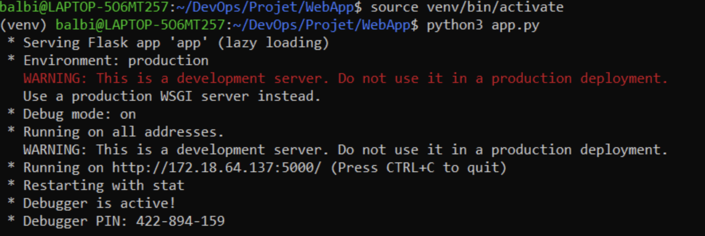 <br>
   Running app inside a python virtual environment (venv) with python only.
   <br> <br> 
</div>


<hr style="border: 1px dashed #333;">

### 2. CI/CD
<div style="text-align: center;">
   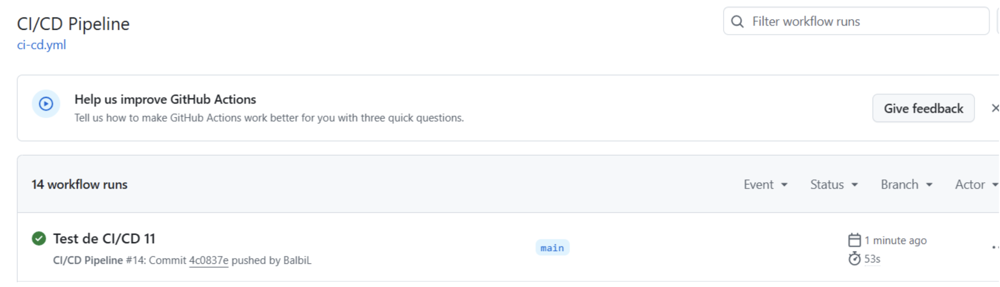 <br> 
   Working Ci/CD pipeline.
   <br> <br> 

   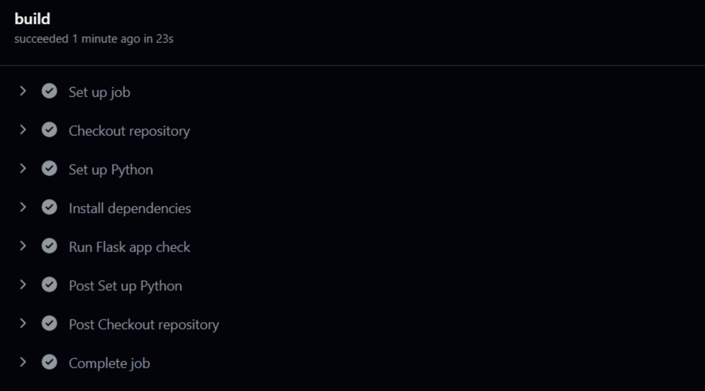 <br> 
   Integration with python Flask app check.
   <br> <br> 

   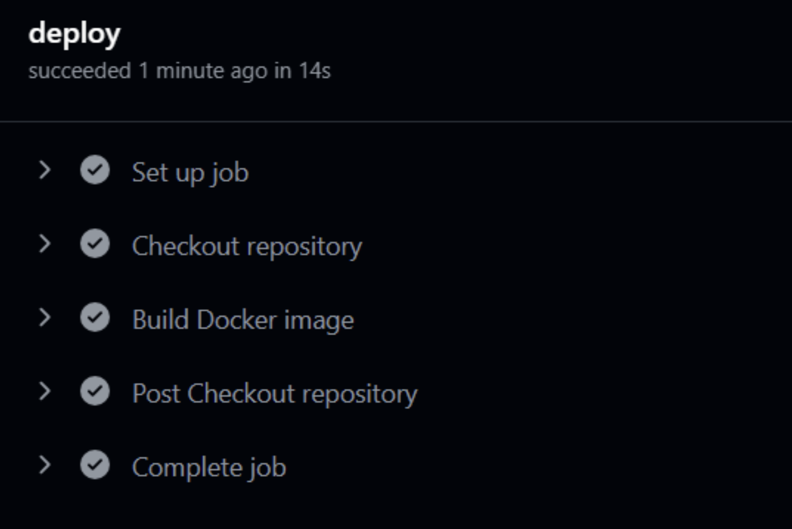 <br> 
   Deployment with build of docker image.
   <br> <br> 

   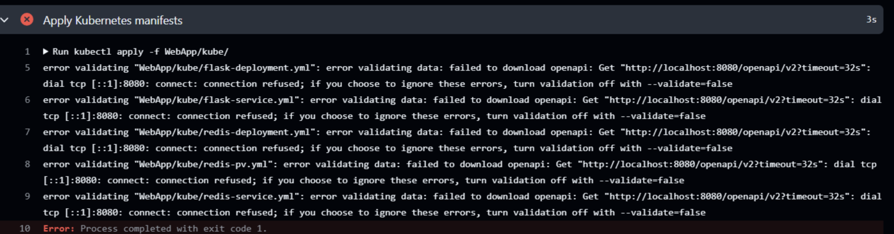 <br> 
   Error for Kubernetes Continuous Deployment.
   <br> <br> 

   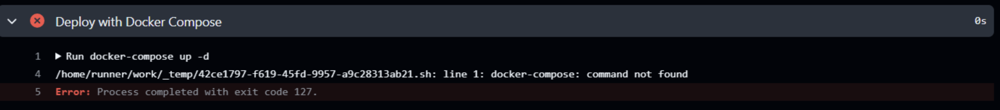 <br> 
   Error for docker compose Continuous Deployment.
   <br> <br> 
</div>


<hr style="border: 1px dashed #333;">

### 3. Docker image
<div style="text-align: center;">
   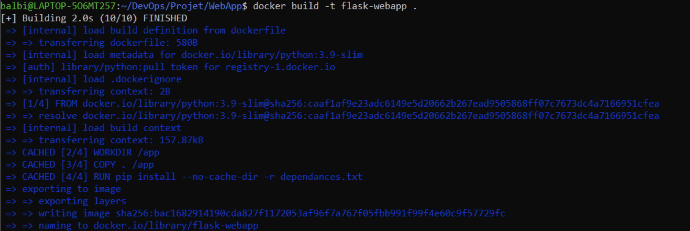 <br> 
   Building docker image of app thanks to dockerfile.
   <br> <br> 

   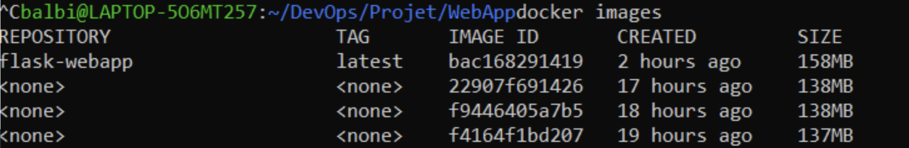 <br> 
   Built docker image.
   <br> <br> 

   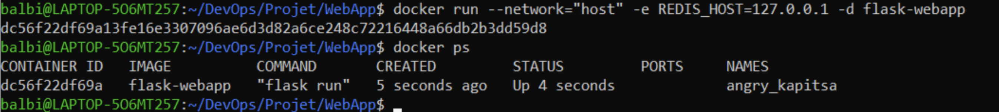 <br> 
   Running docker container in the background, ensure it is running with docker ps.
   <br> <br> 
</div>


<hr style="border: 1px dashed #333;">

### 4. Docker compose
<div style="text-align: center;">
   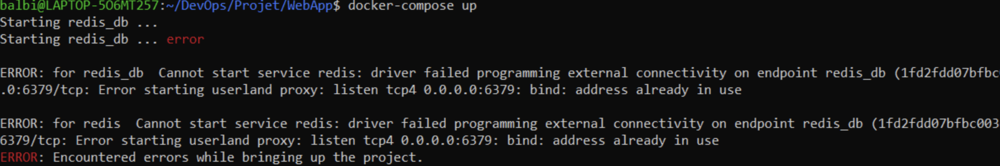 <br> 
   Trying to use docker-compose with Redis already started: fails, because docker-compose file starts Redis itself and here the 6379 port is already taken by the previously started Redis services.
   <br> <br> 

   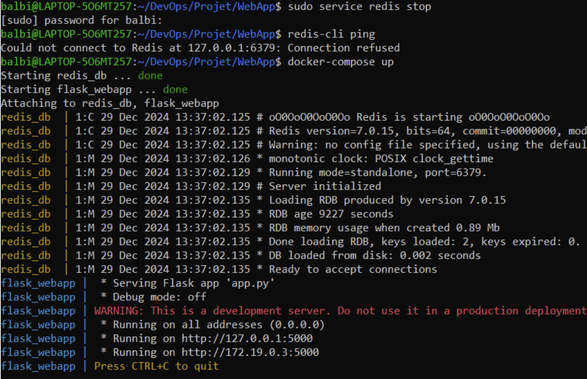 <br> 
   Running the app with docker-compose (can run in the background as well). Here you can see the automatic redis connection does not fail since the redis services were not already started.
   <br> <br> 
   
   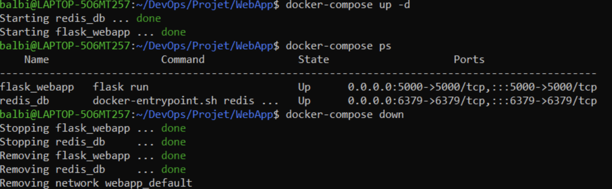 <br> 
   Docker-compose running in background then stopping it.
  <br> <br> 
</div>


<hr style="border: 1px dashed #333;">

### 5. Orchestration using Kubernetes
<div style="text-align: center;">
   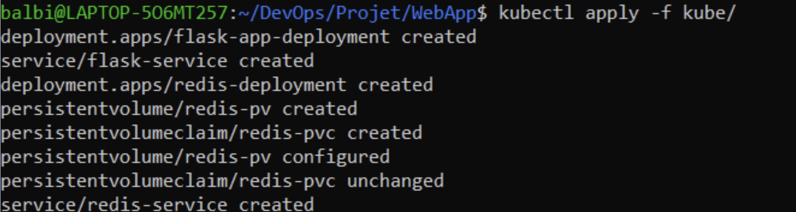 <br> 
   
   Applying all manifest files after starting minikube (all files are in the `/kube` directory, so that you can apply them all at once.)
   <br> <br> 

   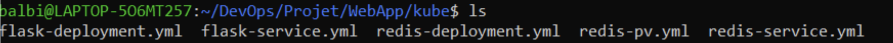 <br> 
   kube directory
   <br> <br> 

   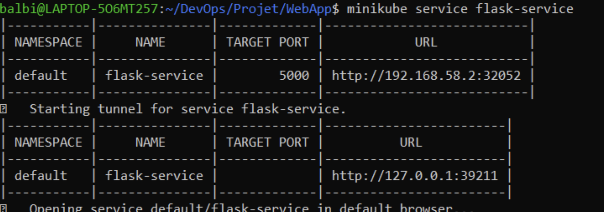 <br> 
   Exposing the service for the flask app with Minikube. App is now accessible via a browser using the second displayed ip address: (localhost) and port.
   <br> <br> 
</div>


<hr style="border: 1px dashed #333;">

### 6. Configure and provision a virtual environment / IaC approach
**Note**: As explained in part **III-Instructions**, this part runs from a windows machine.

<div style="text-align: center;">
   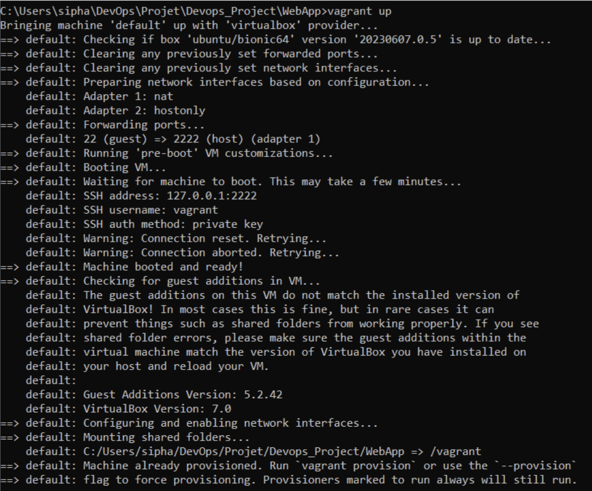 <br> 

   `Vagrant up` to restart the powered off VM (if you have no previous VM, the first vagrant up will create a new VM and provision it with ansible at the same time).
   <br> <br> 

   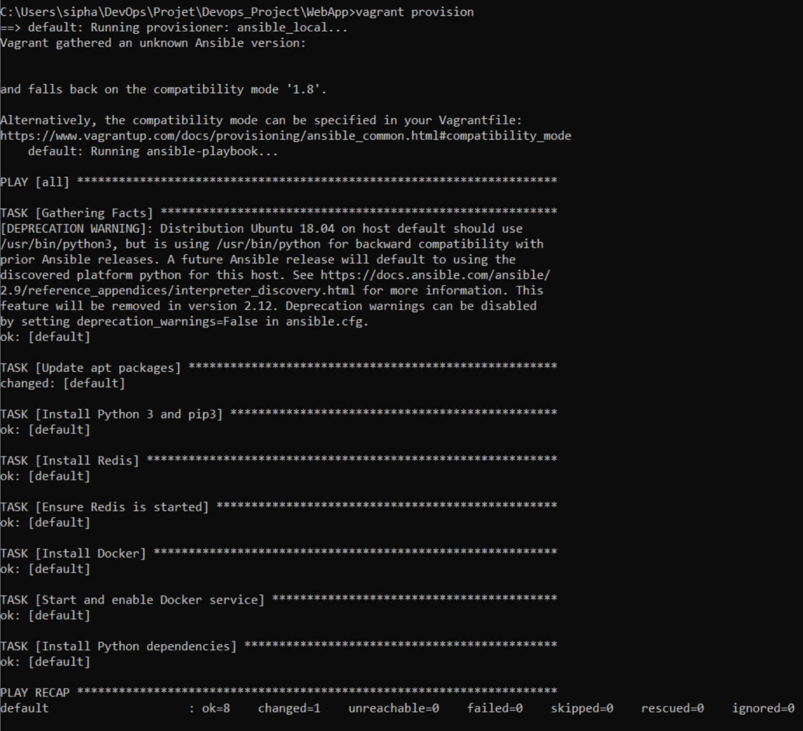 <br> 
   Provisioning the VM with our ansible playbook. We can see each task runs well.
   <br> <br> 

   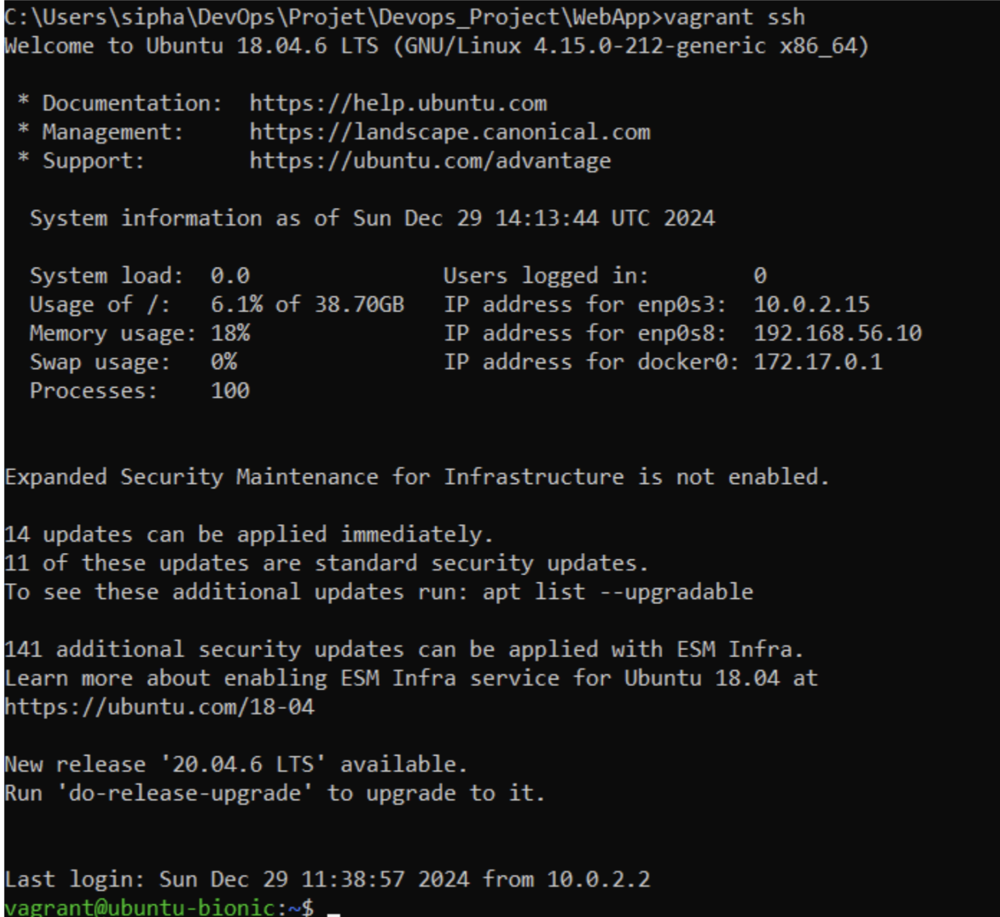 <br> 
   Connecting with ssh from the host machine to the VM terminal.
   <br> <br>

   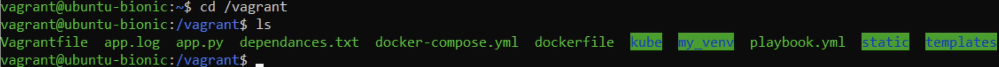 <br> 
   
   Accessing the shared folder inside the VM (copy of the `/WebApp` directory on the host machine).
   <br> <br> 

   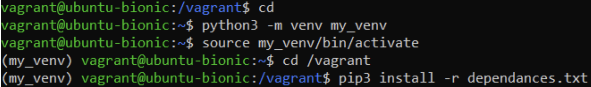 <br> 
   Creating a python virtual environment on the VM, activating it and installing the requirements inside the venv. 
   <br> <br> 
</div>

**Note**: The python virtual environment must be created outside of the shared folder of the VM, or it will prompt an error:

<div style="text-align: center;">
   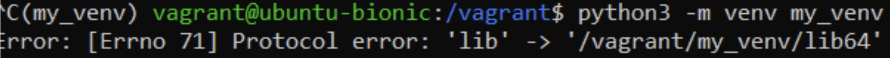 <br> 
   Error when creating the venv in the shared folder.
   <br> <br> 

   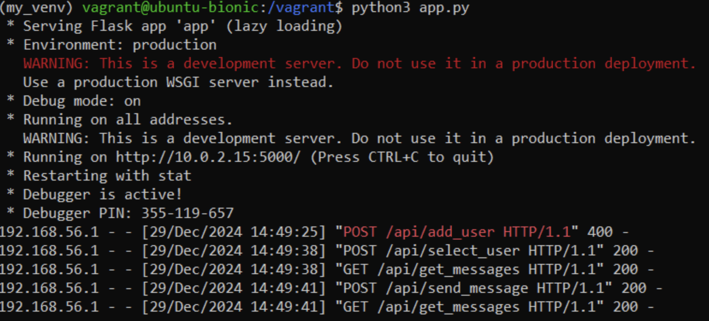 <br> 
   Running the app with python on the VM.
   <br> <br> 

   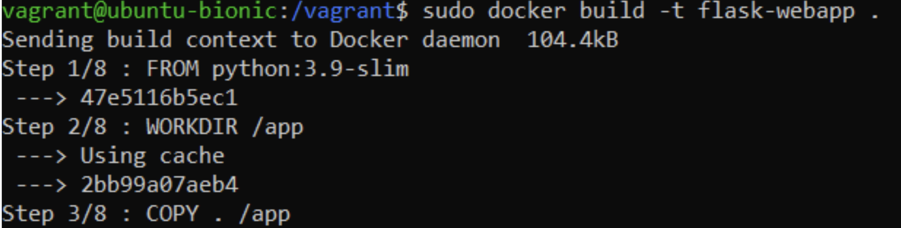 <br> 
   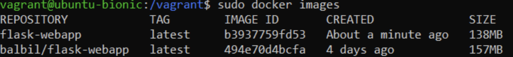 <br> 
   Docker and docker hub images on the VM.
   <br> <br> 

   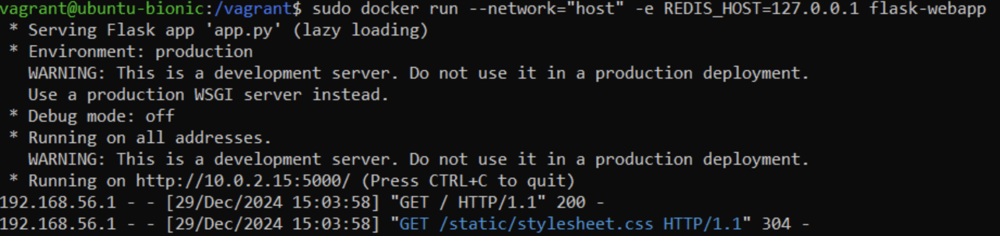 <br> 
   App running in a docker container on the VM.
   <br> <br> 
</div>

## III. Instructions

### 1. WebApp
Running the app with python on linux machine.
**Prerequisite**: Having python3, python3 venv, pip3 and Redis installed.

- You can install python3 venv with: 
   ```bash
   sudo apt install python3-venv
- If not done already, clone the repository.
- Navigate to to the `WebApp` directory.
- Activate the redis services with: 
   ```bash
   sudo service redis start
- You can ensure redis is active with: 
   ```bash
   redis-cli ping
- Create the python virtual environment if its the first time running the app: 
   ```bash
   python3 -m venv venv
- Activate the Python virtual environment: 
   ```bash
   source venv/bin/activate
   ```
   *A (venv) will appear before your root directory, meaning you have successfully activated the venv.*
- Install the dependencies in `dependances.txt` inside the virtual environment: 
   ```bash
   pip3 install -r dependances.txt
- Run the app with: 
   ```bash
   python3 app.py
- The app is now running on localhost, accessible through your browser by typing: `localhost:5000`

When finished, you can deactivate the venv with: `deactivate`


### 2. Docker
**Prerequisites**: Having Docker installed and a DockerHub account, Redis services started.

- Still in the `WebApp` directory, activate the redis service if not up: 
   ```bash
   sudo service redis start
- Build locally the docker image: 
   ```bash
   docker build -t flask-webapp .
- Or pull the image from DockerHub: 
   ```bash
   docker pull balbil/flask-webapp
- Run the images with:
   ```bash
   docker run --network="host" -e REDIS_HOST=127.0.0.1 flask-webapp 
   docker run --network="host" -e REDIS_HOST=127.0.0.1 balbil/flask-webapp 
   ```
   *Depending of if want to use the dockerhub image or the locally built image.*

- If you want to run the container in the background, use the -d flag:
   ```bash
   docker run --network="host" -e REDIS_HOST=127.0.0.1 -d flask-webapp 
   docker run --network="host" -e REDIS_HOST=127.0.0.1 -d balbil/flask-webapp 
- And then ensure the container is running with: 
   ```bash
   docker ps #(displays the containerID)
   ```

Once again the app is accessible on `localhost:5000`

You can stop the container with: 
   ```bash
   docker stop <containerID>
   ```


### 3. Docker compose  

**Prerequisite**: Same as Docker.

- Redis is started by docker-compose, you have to beforehand stop the redis services with : 
   ```bash
   sudo service redis stop
   ```

- Start the service with: 
   ```bash
   docker-compose up
   docker-compose up -d #(to run in the background)
   ```

You can acces the container state with: 
```bash
docker-compose ps
```
   - App accessible on `localhost:5000`
   - Stop the service with: `docker-compose down`

### 4. Kubernetes
**Prerequisite**: Minikube installed, and all the prerequisite above.

- Still in WebApp directory, activate minikube: 
   ```bash
   minikube start
   ```
- Activest the manifest yaml files with: 
   ```bash
   kubectl apply -f kube/
   ```
- You can check the pods and services status :
   ```bash  
   kubectl get pods
   kubectl get services
   kubectl get pvc #(must be bound)
   ```
- Expose the minikube service with: 
   ```bahs
   minikube service flask-service
   ```
   *Two ip addresses will be displayed, the app runs on the second one with its port number (with nothing in the “target port” tab).*

- To stop the services: 
   ```bahs
   kubectl delete -f kube/
	minikube stop
   ```

### 5. Vagrant and IaC approach
**Note**: For this part, any team member could not have vagrant working on a Linux system since we use Linux subsystems in windows and MacOs, both having problems with Vagrant.
So all the vagrant testing and deployment was made from a windows machine, in the command terminal. The git repository is still the same, but no tests were made from a linux machine.

**Prerequisites**: Vagrant and VirtualBox installed

- In the repo, navigate to the `WebApp` folder.
- Create or power an existing VM with: 
   ```bash
   vagrant up 
   ```
   If the VM was already previously provisioned, you can update the provisioning with: 
   ```bash
   vagrant provision 
   ```
- Connect to the vagrant VM with: 
   ```bash
   vagrant ssh
   ```
- Once in the VM terminal, navigate to the shared folder: `cd /vagrant`

   In there you should see the same files as in `/WebApp` in the host machine.

You can now run the app either with python or docker inside the VM. 
The playbook installed most of the dependencies and services so for python you can just:
   - Create the python virtual environment if its the first time running the app: 
      ```bash
      python3 -m venv venv
      ```
   - Activate the Python virtual environment: 
      ```bash
      source venv/bin/activate
      ```
   - Install the dependencies in `dependances.txt` inside the virtual environment: 
      ```bash
      pip3 install -r dependances.txt
      ```
   - Run the app with: 
      ```bash
      python3 app.py
      ```
      ***Note:*** *You have to create the venv outside of the shared folder /vagrant of the VM, or an error will prompt. Create the venv in the VM’s root directory, then activate the venv inside of the shared folder.*
   - This time the app will run on the VM’s IP, check the vagrantfile for to see it’s: `192.168.56.10`

And for docker:
   - Build locally the docker image:
      ```bahs
      docker build -t flask-webapp .
      ```
   - Or pull the image from DockerHub: 
      ```bahs
      docker pull balbil/flask-webapp
      ```
   - Run the images with:
      ```bash
      docker run --network="host" -e REDIS_HOST=127.0.0.1 flask-webapp 
      docker run --network="host" -e REDIS_HOST=127.0.0.1 balbil/flask-webapp 
      ```
   - This time the app will run on the VM’s IP as well, check the vagrantfile for to see it’s: `192.168.56.10`

### 6. CI/CD
To test the Ci/Cd pipeline, just pull or push some changes from the main branch. The results of the workflow are displayed in the Actions tab on the github repository page. 


## IV. Links
DockerHub account with image: https://hub.docker.com/u/balbil


## V. Additional Info
In the requirements, Flask Redis and Werkzeug are on older versions. That is because newer versions are not compatible with vagrant VMs, and Flask depends on Werkzeug so they have to be the same version.

The repository contains a file named `commande_utiles.txt`. This file was a tool to help us out for testing each other's part, as well as gain time and keep track of our progress.
