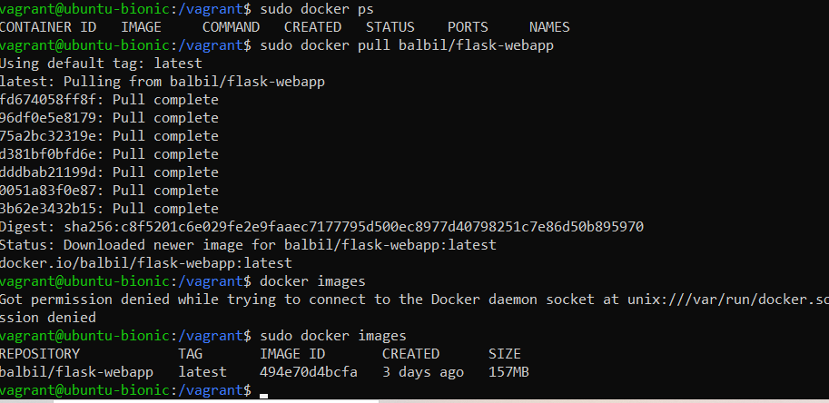
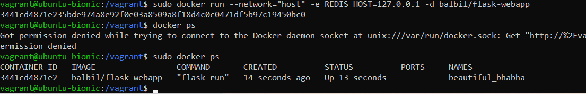

# DevOps Project
Lucas Balbi, Elise Bruneton et Victor Denis

## Description
This project is a messaging platform that allows users to create accounts, send messages, and manage conversations. 

---

## Work Performed
### Features
- User Management: 
  - Create new users with name, surname, and email.
  - Delete users.
  - View a list of saved accounts.
- Messaging System:
  - Select a user to send messages.
  - View message history.
  - Delete messages.
- Integration:
  - Deployed using 
  
### Bonus Tasks
- 

---

## Screenshots
All screenshots are stored in the `captures/` folder. Here are the explaination for every screen:

1. **Web Page**
**User Creation Page**
   
**Message History**
   
2. **Vagrant**
   
   

---

## Installation Instructions
### Prerequisites
1. Docker installed on your machine.
2. Python 3.9 or above.
3. Redis.
4. 

### Steps

1. First Step:
- Clone the repository:
   ```bash
   git clone https://github.com/BalbiL/Devops_Project.git
- Navigate to the `WebApp/` directory.
- Install dependencies:
   ```bash
      pip install -r dependances.txt

2. Redis:
- Start redis
   ```bash
      sudo service redis start
- Open the Redis shell:
   ```bash
      redis-cli
- Test server response:
   ```bash
      redis-cli ping

3. Docker:
- Start Redis:
   ```bash
      sudo service redis start
- Build the app image: 
   ```bash
      docker build -t flask-webapp
- Run the app via Docker:
   ```bash
      docker run --network="host" -e REDIS_HOST=127.0.0.1 -d flask-webapp
- Check if the container is running:
   ```bash
      docker ps
- The container runs in the background thanks to the -d option in the run command. To stop the container:
   ```bash
      docker stop idcontainer
*The container ID is displayed with docker ps*

4. Docker compose:
- Start the container:
   ```bash
      docker-compose up -d
***Note!*** *Redis is started by docker-compose. Ensure to stop any existing Redis services before running: sudo service redis stop*
- Debugging:
   ```bash
      docker-compose logs -f
*Allows you to view the container logs.*
- Verify the container is running:
   ```bash
      docker-compose ps
- Stop the container:
   ``bash
      docker-compose down